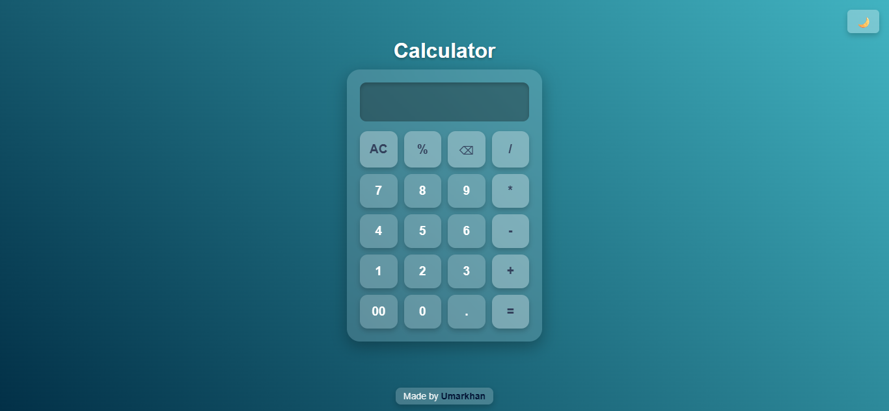

# Calculator


---

A modern glassmorphic calculator built with HTML, CSS, and JavaScript, featuring light/dark mode toggle, animated heading, and smooth button interactions.

---

## Features

- **Glassmorphic UI** – Semi-transparent design with blur effects.
- **Dark/Light Mode Toggle** – Saves user preference using `localStorage`.
- **Smooth Animations** – Animated heading and interactive buttons.
- **Responsive Design** – Fits different screen sizes.

---

## Live Demo

[View Live Demo](https://calculator-by-umar-khan.netlify.app/)

---

## Screenshots

| Light Mode                                    | Dark Mode                                   |
| --------------------------------------------- | ------------------------------------------- |
|  |  |

---

## How to Use

1. Clone this repository:

   ```bash
   git clone https://github.com/Umar-khan6/calculator.git

   ```

2. Open the project folder:

   ```bash
   cd calculator

   ```

3. Open index.html in your browser.

---

## Technologies Used

- **HTML5**
- **CSS3 (Flexbox/Grid)**
- **JavaScript (DOM Manipulation, LocalStorage)**

---

## Contact

Feel free to connect with me:

- **LinkedIn:** [umarkhan24](https://linkedin.com/in/umarkhan42)
- **GitHub:** [Umar-khan6](https://github.com/Umar-khan6)
- **Email:** umarkhan655020@gmail.com

